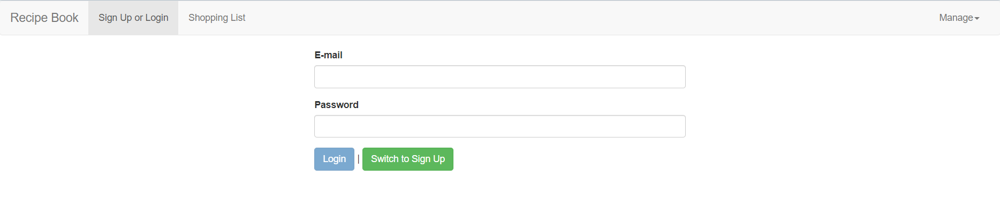
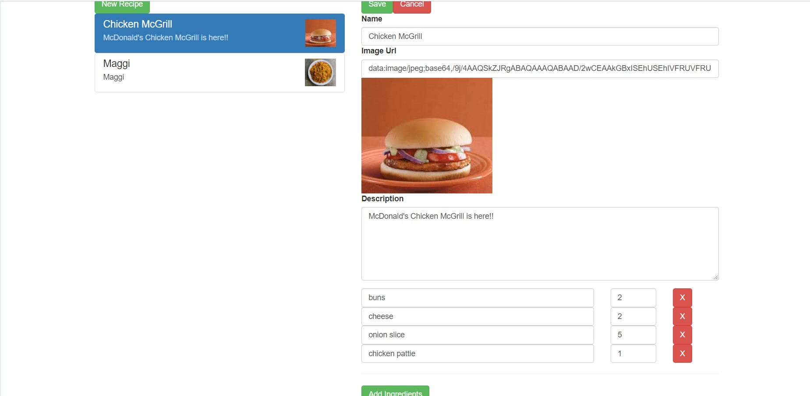

# Recipe-Book
This app manages your recipe list and allows you to edit them for any changes in the ingredients. The app was build using Angular 2+ and uses the basic concepts of Event Binding, Data Binding,Angular Routes, Pipes,Observables, etc.
To handle database, Firebase API is used.

Some of the images from the app:

## Login Interface

## Edit Interface

